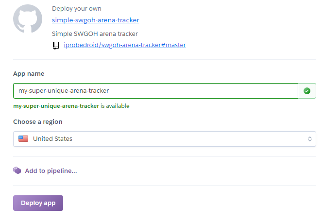
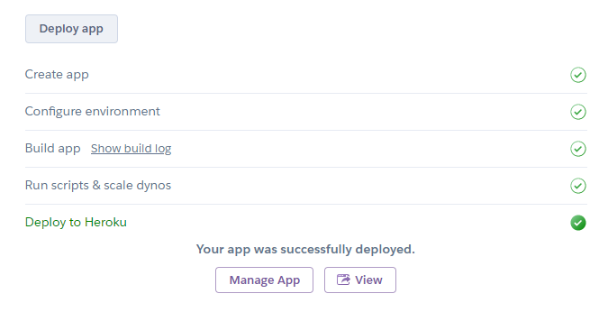
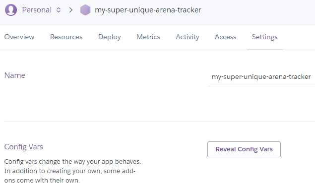
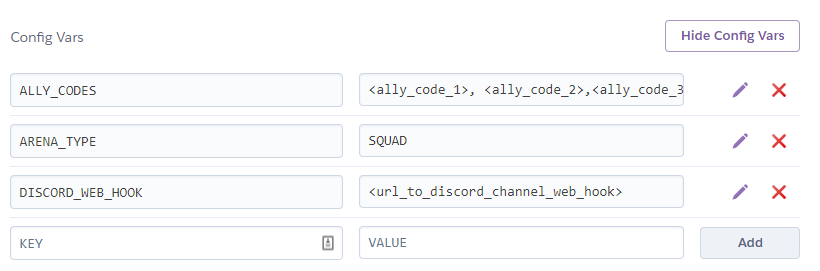
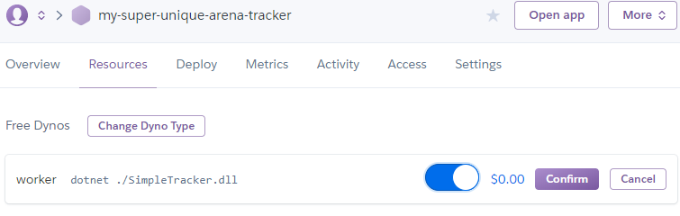
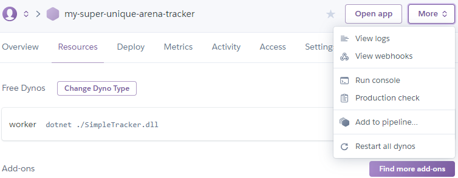
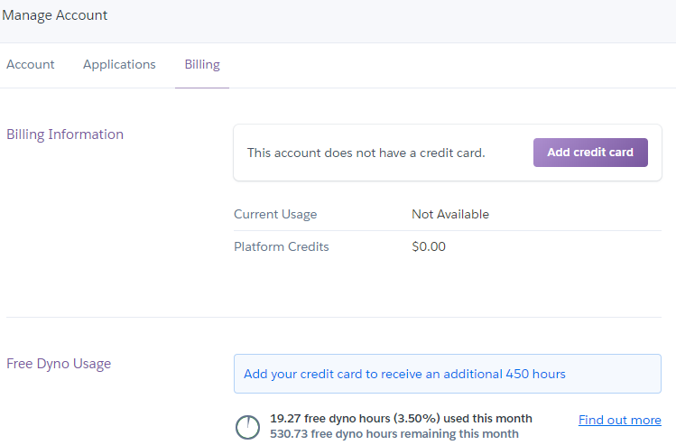

# Join our [Discord](https://discord.gg/xcjvKPM) channel to be updated.

# Simple SWGOH Arena Tracker
[DiscordChannel](https://discord.gg/xcjvKPM) --my capacity is quite limited, yet you can help each other on this channel

## Deploy straight to Heroku(24/7 free if a credit card registered)

<!--  -->
<!--  -->

## Configuration

### Set environment variables:

|Variable Name| Description                             | Notes |
|-------------|-----------------------------------------|------ |
|ARENA_TYPE | `SQUAD` or `FLEET`                 | Required(yet `SQUAD` is by default if not set)|
|DISCORD_WEB_HOOK| Webhook to discord channel.|  Required|
|ALLY_CODES | Comma separated list of ally codes. Example: `123456789,123456788,123456999`| Ignored if `ALLY_CODES_URL` present|
|ALLY_CODES_URL| URL to a `json` file with players.  Recommended to use secret github gist like this [example](https://gist.github.com/iprobedroid/603fc48a5ec43afc9e53ee845e91e042/raw)|[How to find discord id.](https://support.discordapp.com/hc/en-us/articles/206346498-Where-can-I-find-my-User-Server-Message-ID-). Format: `https://gist.github.com/<user_name>/<gist_id>/raw` Notes:`name` and `discordId` is not required, just set them to an empty string `""`, `userIcon` is for discord emoji(:emoji_code:)  |Recommended|

## Deploy with Heroku steps
### 0. Delete previously created application(if you have one).

### 1. Click the button below.
<!-- 
 -->
<!--  -->

### 2. Create the application with a unique name and press `Deploy app` button.

### 3. Once deployed press `Manage App` button.

### 4. Go to settings tab.

### 5. Press `Reveal Config Vars` button and set environment variables.

Ally codes is a comma-separated string(like: 123456789,125456189 ...).

You will need to create a Discord web hook in the channel of choice.
Fill the `DISCORD_WEB_HOOK` with the that unique url.

Choose your arena type - `SQUAD` or `FLEET`.
Check the application logs if the tracker stops sending messages.

### 6. Activate the resource to run the tracker under the `Resources tab`.

### 7. Check logs under `More -> View logs` for any errors.

### 8. Add a credit card to your profile to get extra free hours for forever free 24/7 hosting.

### 9. Keep only one application and one resource at a time, otherwise you will be charged...

